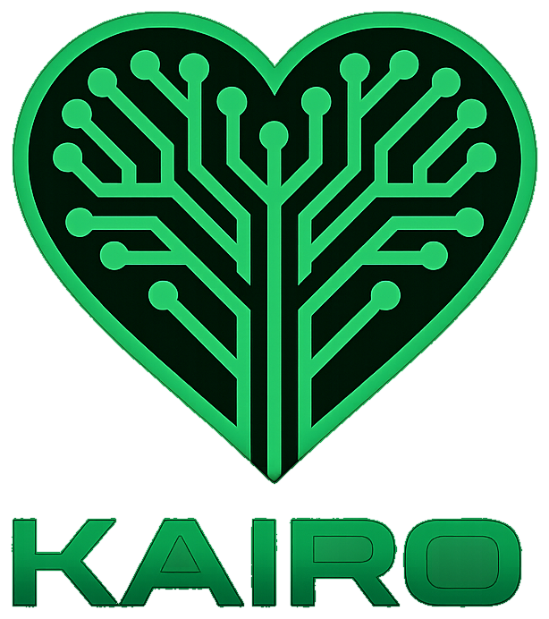

  

  # KAIRO Intelligence

  **Integrated environmental intelligence for decisions that can be understood, acted on, and measured.**

  **ذكاء بيئي متكامل يحوّل البيانات المتفرقة إلى قرار واضح، وإجراء عملي، وأثر قابل للقياس.**

  
  
  
  

  [Explore the platform](https://www.kairo-ai.tech/) · [Unified dashboard](https://www.kairo-ai.tech/dashboard) · [Proof of Impact](https://www.kairo-ai.tech/proof)

---

## The purpose

Environmental information is often fragmented across bills, observations, reports, maps, and technical indicators. Even when the data exists, people still face a harder question: **what should we do next, why, and how will we know it worked?**

KAIRO Intelligence was created to close that gap. It combines transparent calculations, contextual AI interpretation, evidence boundaries, and impact verification in one Arabic-first decision experience. Its highest goal is not to generate more dashboards; it is to help a person, community, school, business, or city make a better environmental decision and prove the result.

> **From fragmented signals to measurable environmental action.**

## الهدف الأسمى

أُنشئت **KAIRO Intelligence** لمعالجة الفجوة بين توافر البيانات البيئية والقدرة على تحويلها إلى قرار فعلي. تجمع المنصة المدخلات المتفرقة، وتفسّرها بلغة مفهومة، وتوضح مستوى الثقة وحدود النتيجة، ثم تقترح إجراءً قابلًا للتنفيذ وطريقة دقيقة لقياس أثره.

النجاح في KAIRO لا يعني الحصول على توصية جميلة؛ بل يعني **تغيير قرار حقيقي وتحقيق وفر مالي أو بيئي يمكن التحقق منه وتكراره**.

## What KAIRO does

| Intelligence system | Decision supported | Typical measurable outcome |
| --- | --- | --- |
| **KAIRO SIGNALS** | Anticipate environmental pressure before impact escalates | Forecast window, confidence, and priority drivers |
| **Water & scarcity** | Find consumption inefficiency and inspection priorities | Efficiency score, estimated waste, and a verification plan |
| **Food security** | Reduce waste across purchasing, storage, and consumption | Avoided waste, cost, water, and emissions |
| **Energy intelligence** | Identify high-impact efficiency opportunities | Cost, energy, and carbon reduction potential |
| **Low-impact mobility** | Compare travel choices across cost, time, carbon, and exposure | Monthly footprint and realistic alternatives |
| **Urban exposure** | Translate air and location signals into precautionary actions | Exposure indicator, contributing factors, and timing guidance |
| **ReKairo circular economy** | Choose repair, reuse, resale, or responsible recycling | Recovered value and traceable circular impact |
| **Scenario Lab** | Compare interventions before committing resources | Visible assumptions and consistent trade-off analysis |
| **Proof of Impact** | Review a before/after environmental intervention | Normalised savings, evidence references, and inference limits |

## Built for different decision makers

- **Individuals and families** — practical steps to reduce bills, waste, and daily exposure.
- **Communities and field teams** — clearer local signals and fairer intervention priorities.
- **Schools, universities, and researchers** — explainable experiments and documented scenarios.
- **Businesses and facilities** — operational efficiency, lower cost, and stronger sustainability evidence.
- **Cities and public authorities** — earlier, more transparent planning with measurement clearly separated from estimation.

## The KAIRO decision loop

~~~mermaid
flowchart LR
    A["Inputs & evidence"] --> B["Validated calculations"]
    B --> C["Contextual AI interpretation"]
    C --> D["Priority & next action"]
    D --> E["Baseline and follow-up"]
    E --> F["Reviewable impact proof"]
    F --> A
~~~

Every useful result aims to answer five questions:

1. What happened?
2. What evidence supports it?
3. What are the limits or assumptions?
4. What is the best next action for this audience?
5. How should the outcome be measured?

## Real AI, bounded by evidence

KAIRO's AI is an interpretation and decision-support layer—not a replacement for measurement.

- Browser requests go through a same-origin, server-side AI gateway.
- Secrets and upstream model identities never enter the client bundle or public responses.
- Structured analyses use strict schemas and validated inputs.
- Receipt and device-image workflows use real vision analysis rather than demo timers or fixed results.
- Deterministic calculations remain separate from AI-generated explanation.
- Capability-aware routing, timeouts, retry rules, and server-side fallback improve resilience.
- Public health, engineering, and environmental guidance carries evidence limits and appropriate disclaimers.

## Proof of Impact

The **/proof** workspace turns a recommendation into a reviewable before/after record:

- action, owner, date, and fixed comparison scope;
- baseline and follow-up periods;
- energy, water, food-waste, carbon, and cost evidence;
- period-normalised deterministic savings;
- evidence references and potential confounders;
- exportable JSON evidence pack;
- AI review constrained to the supplied measurements and calculations.

KAIRO does not invent measurements, claim causality without evidence, or represent internal analysis as independent certification.

## Architecture

~~~mermaid
flowchart TB
    UI["React 19 · bilingual Apple Glass UI"]
    API["Same-origin API boundary"]
    SEC["Validation · rate limits · origin controls"]
    CALC["Deterministic environmental engines"]
    AI["Server-side AI orchestration"]
    DATA["Owner-isolated cloud data + local resilience"]
    PROOF["Reports · scenarios · proof of impact"]

    UI --> API
    API --> SEC
    SEC --> CALC
    SEC --> AI
    CALC --> PROOF
    AI --> PROOF
    DATA <--> API
~~~

### Technology

- React 19, TypeScript, Vite, and React Router
- Tailwind CSS, Framer Motion, HeroUI, and Recharts
- Express and Vercel Functions for the server boundary
- Supabase with Row Level Security for optional cloud persistence
- Server-side multi-provider AI orchestration for text, structured, and vision workloads
- Automated SEO asset generation, bilingual metadata, and responsive reports

## Security and privacy

Security is part of the product architecture:

- API keys are server-only and never use a browser-exposed prefix.
- Requests, prompts, schemas, histories, images, MIME types, sizes, and file signatures are bounded and validated.
- Same-origin enforcement, CSP, clickjacking protection, restrictive permissions, no-store API responses, and rate limiting are applied.
- Supabase records are owner-isolated with forced Row Level Security.
- Public errors are redacted and provider/model identities are not disclosed.
- Cloud persistence is optional; resilient device storage keeps core workflows usable.

Please report security concerns privately as described in [SECURITY.md](./SECURITY.md). Do not publish sensitive findings in a public issue.

## Design principles

The interface follows KAIRO's visual language: deep environmental tones, emerald intelligence signals, layered Apple-inspired glass surfaces, strong contrast, Arabic/English direction support, responsive charts, reduced-motion support, keyboard navigation, and touch-safe controls.

## Local development

### Requirements

- Node.js 22
- npm 10+

### Setup

~~~bash
git clone https://github.com/marwanyasser2005/kairo-intelligence.git
cd kairo-intelligence
npm ci
~~~

Copy **.env.example** to **.env.local** and provide at least one server-side AI credential. Optional cloud persistence uses only a publishable Supabase browser key; privileged database keys must never be exposed to the client.

~~~bash
npm run dev
~~~

Open **http://localhost:3000**.

## Quality gates

~~~bash
npm run lint
npm test
npm run build
npm run verify:seo
~~~

| Command | Purpose |
| --- | --- |
| **npm run dev** | Run the web app and local API gateway |
| **npm run lint** | TypeScript quality gate |
| **npm test** | AI routing, security, data, SEO, UI, scenarios, and impact tests |
| **npm run build** | Production, SSR/SEO, and hosting builds |
| **npm run verify:seo** | Validate generated SEO routes and metadata |

## Project structure

~~~text
api/                 Vercel API functions
components/          Shared UI, navigation, reports, and AI status
config/              Brand, audiences, capabilities, and public knowledge
contexts/            Application state and language/theme context
pages/               Product pages and environmental systems
services/            AI clients, calculators, persistence, and decision logic
supabase/migrations/  RLS-protected data model
tests/                Automated quality and security coverage
utils/                Export, file validation, storage, and calculations
~~~

## Capability tiers

The seven result capabilities are split into **three core** and **four support** capabilities, plus the scenario lab as a decision tool. The split is a documented, test-enforced model in `config/capabilityPriority.ts`, not a preference: it scores every capability on financial impact, audience reach, operational readiness, verifiability, national urgency, decision frequency, and resource-system ownership.

| Tier | Capabilities | Why |
| --- | --- | --- |
| **Core** | Water, Energy, Food | The water–energy–food resource system: domains a user consumes and pays for directly, each with a deterministic engine and a measurable outcome |
| **Support** | KAIRO SIGNALS (live early warning), Mobility, Urban exposure, ReKairo circularity | The live prevention layer plus the capabilities that extend the picture to a daily pattern |
| **Tool** | Scenario lab, Proof of impact | Comparison and verification layered on top of results |

## Model-improvement telemetry

Every analysis run records one anonymous row so the estimation models can be reviewed and improved from real usage: module, numeric inputs, computed facts, outcome metrics, and whether the run needed review.

- **Privacy by design**: there is no user identifier, no name, no meter number, no image, and no free text. `services/analysisTelemetry.ts` scrubs sensitive keys, prunes empty branches, and caps payload sizes before writing.
- **Write-only**: `kairo_analysis_runs` has insert-only RLS for `anon` and `authenticated`; clients can never read the table back.
- **Best effort**: if the cloud is unavailable or the migration has not been applied, the app keeps working and telemetry pauses for a cooldown window instead of retrying every request.
- **Applying the migration**: run `npx supabase db push` with a linked project, or paste `supabase/migrations/20260915000000_kairo_analysis_runs.sql` into the Supabase SQL editor.

## Mobile app readiness

The web app is built so it can be wrapped as an Android or iOS application without rewriting screens:

- **Installable PWA**: `public/site.webmanifest` declares `display: standalone`, app shortcuts to the core three and the signal layer, theme colors, and a maskable icon; `index.html` sets `viewport-fit=cover` and the iOS `apple-mobile-web-app-*` meta tags.
- **App-style navigation**: `components/MobileTabBar.tsx` renders a bottom tab bar on phones with the same information architecture as the dashboard (water, energy, food, signals), and the shell reserves space for it including `env(safe-area-inset-bottom)` on notched devices.
- **No browser-only assumptions**: every AI call goes through the same-origin `/api/ai/generate` gateway, so a native shell only needs to point at the deployed origin; there are no provider keys or CORS dependencies in the client.
- **Capacitor path**: `npx cap add android` / `npx cap add ios` against this repository, then point the WebView at the deployed origin (or `dist/`), and reuse the existing manifest icons for the launcher.

## Deployment

The production application is deployed on Vercel. Configure secrets only through encrypted project environment variables, run the full quality gates, then deploy the production build. The official experience is available at [www.kairo-ai.tech](https://www.kairo-ai.tech/).

## Founder

**Marwan Yasser Hassan Abdel Ghafar** — Founder, developer, and AI engineer. KAIRO was initiated in Cairo, Egypt, at the intersection of artificial intelligence, environmental science, sustainable buildings, and smart cities.

## Contributing

This repository follows a review-first workflow. Read [CONTRIBUTING.md](./CONTRIBUTING.md) before proposing a change. Contributions must preserve evidence integrity, Arabic/English quality, accessibility, security boundaries, and KAIRO's visual identity.

## Responsible-use note

KAIRO is a decision-support platform. Its estimates and forecasts do not replace field measurements, certified environmental assessment, professional engineering advice, or medical diagnosis.

---

  <strong>KAIRO Intelligence</strong> 
  Understand the signal. Choose the action. Prove the impact.  
  © 2026 KAIRO Intelligence. All rights reserved.

